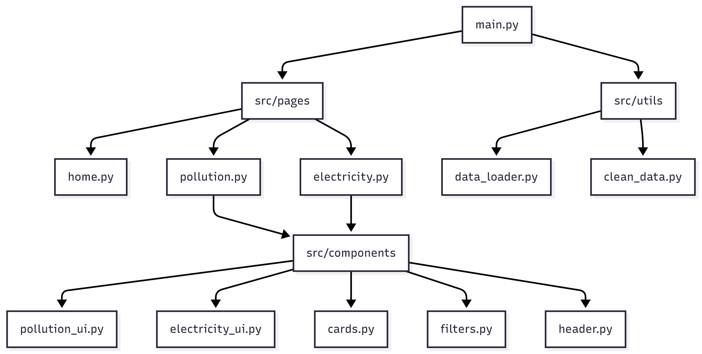

# EcoPulse

<video src="vidéo.mp4" >

EcoPulse est un dashboard interactif conçu avec **Dash** et **Plotly**. Il permet d'analyser la corrélation entre la production d'électricité mondiale et la qualité de l'air.

## User Guide
**Déploiement local**

Pour lancer le dashboard sur votre machine, suivez ces étapes :

1 - **Cloner le dépôt :**
```bash
    git clone https://github.com/IssamRamzi/EcoPulse
    cd EcoPulse
```

2 - **Créer un environnement virtuel :** 
```bash
    python -m venv .venv
    # Windows :
    .venv\Scripts\activate.bat
    # Unix :
    source .venv/bin/activate    
```

3 - **Installer les dépendances :** 
```bash
    python -m pip install -r requirements.txt
```

4 - **Lancer l'application :**
```bash
    python main.py
```

5 - **Accés au dashboard :** 
    Ouvrez votre navigateur et allez a l'adresse : http://127.0.0.1:8050/

## Data
Le dashboard repose sur deux jeux de données principaux issus de sources Open Data :
1 - **Air Quality Data** : Contient les valeurs AQI (Air Quality Index). Les variables incluent les niveaux de (CO, NO2, Ozone etc).
 - Source : https://www.kaggle.com/datasets/hasibalmuzdadid/global-air-pollution-dataset

2 - **Electricity Production Data** : Statistiques annuelles par pays sur la production nette d'électricité, segmentées par source (Hydro, Solaire, Fossile).
 - Source :  https://www.kaggle.com/datasets/sazidthe1/global-electricity-production

## Developer Guide
L'application suit une structure modulaire pour faciliter l'ajout de nouvelles fonctionnalités.




**Ajouter une page ou un graphique**
1. **Graphique**: Créez une fonction de génération de figure dans le dossier src/components (ex: src/components/pollution_ui.py)
2. **Page**: Ajoutez un nouveau fichier dans src/pages/. Utilisez `dash.register_page(__name__)` pour que la page soit automatiquement détéctée par le systeme de routing de Dash. 
3. **Données**: Ajoutez la logique de chargement dans src/utils/data_loader.py pour centraliser les accès au DataFrame.

## Rapport d'analyse
- **Corrélation Energie/Pollution**: Les pays présentant un mix énergétique fortement dépendant dépendant des combustibles fossiles (charbon/gaz) affichent des concentrations de NO2 et de particules fines (PM2.5) nettement plus élevées dans leurs zones urbaines.
- **Transition Energétique**: L'analyse géolocalisée montre que l'Europe et certains pays d'Amérique latine ont les parts de renouvelables les plus élevées, ce qui se traduit par une fréquence accrue de catégories AQI "GOOD".
- **Points Chauds**: Le dashboard met en évidence des zones de "Health Emergency" ou l'AQI dépasse 300, souvent corrélées a une production industrielle massive et un mix énergétique non décarboné.

## Copyright
Je déclare sur l'honneur que le code fourni a été produit par moi même, à l'exception des ressources suivantes : 
- **Assistance par Intelligence Artificielle (Gemini)** : 
	Le texte descriptif de la page d'accueil.
	L'IA a aussi été utilisée pour le débug de certains callbacks (notammenet la synchronisation entre le globe interactif et les dropdowns).
